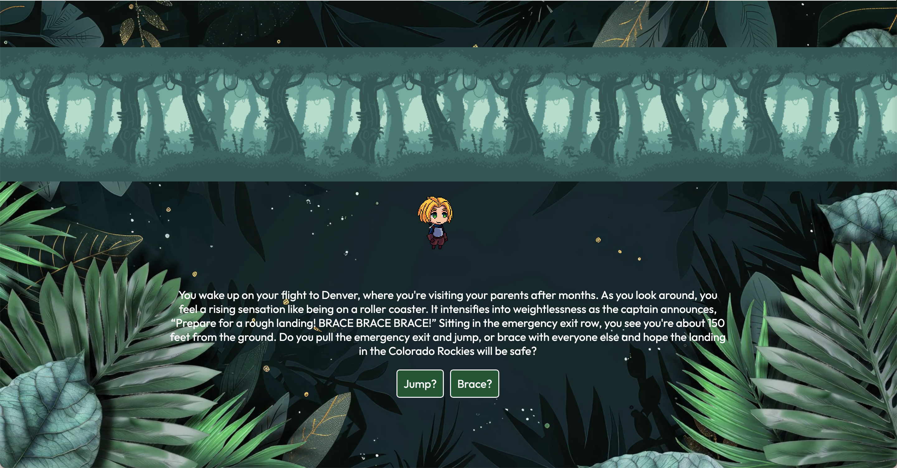

# Interactive RPG

## Table of Contents 
- [Description](#description) 
- [Installation](#installation)
- [Usage](#usage)
- [Testing](#testing)
- [Technologies](#technologies)
- [Contribution](#contribution)
- [Examples](#examples)
- [License](#license)
- [Links](#links)
- [Questions](#questions)

## Description 
    Welcome to Interactive RPG! A role playing game that allows users to test their survival skills as well as chat with other users.

## Installation 
To view and interact with the application:

- Vist deployed application: https://project3-rpg-3t2r.onrender.com

To view and interact with code:

- Clone the repository: https://github.com/jovanna24/Project3-RPG.git
- Install dependencies using `npm install`.

## Usage 
 - Start the development server with `node server`.

## Testing 
    Testing information to be added when developed.

## Technologies Used 

- MERN Stack
- GraphQl 
- Sendbird API

## Contribution

- Developers: Chris Bautista, Daniel Fyerman, Mustafa Ahmed, Austin Hurst, and Jovanna Jimenez 
- BootCampSpot Tutoring Services

## Examples  

## License 
    N/A

## Links 
- Deployed Application: https://project3-rpg-3t2r.onrender.com
- GitHub Repository: https://github.com/jovanna24/Project3-RPG.git

## Questions 
    For any questions, please contact [jovanna24](https://github.com/jovanna24) at jovannajimenez1124@gmail.com.

